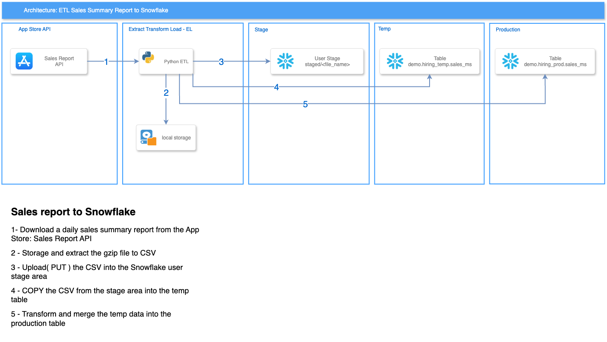

# Storied ETL Exercise

---

The object of this hand-on exercise is to demonstrate the ability to connect to an external API and transfer data into Snowflake.


> **Object**:  Extract the  **Summary Sales Report** for the Storied: Family History App for the month of December 2024 and load it into Snowflake.


>  **Use Case**:  more about [**here**](docs/USE_CASE.md)

# Pre-requisites

---

### Environment Variables

The environment variables has to  be stored in a `.env` file.
The repository include the file [envs](envs) without the credentials. 
You need to create your own `.env` and set the env variables.

### Python

This project was developed using Python 3.11, you will need a python environment to run.

### Optional - Docker

This project provide a Dockerfile to run the python ETL. To run in a container you need to have Docker installed.

# Architecture Solution

---

The solution is based on the following architecture:



# Repository Structure

---


```
├── data > ignored folder created to store localy  the temp files
├── docs
├── notebook
├── src
│   ├── config ->  config files and environment variables
│   ├── pipeline
│   ├── sinks
│   ├── sources
│   └── sql ->  sql scripts to create the tables
├── README.md
├── main.py
├── pyproject.toml
├── requirements.txt
├── setup.py
├── Dockerfile
├── envs
└── uv.lock
```
# How to run

---

### Running with Python

```bash
python main.py  2024-12-01 2024-12-31 0     
```


### Running in a Docker container

Follow the instruction to run in a docker container.

1. Build the image
```bash
docker build -t storied-etl:latest .
```

3. Run the container

```bash
docker run --rm storied-etl  2024-12-01 2024-12-31 0     
```


# Proposal Next Steps

---

To improving the project to enhance  reliability, scalability, and maintainability:

1. **Add Unit Tests**
2. **Add Retry Logic on Failures**
3. Add Rate Limit and API Validation
4. Refactor Architecture for Cloud Run Functions
5. Orchestrate with Apache Airflow for daily reports


